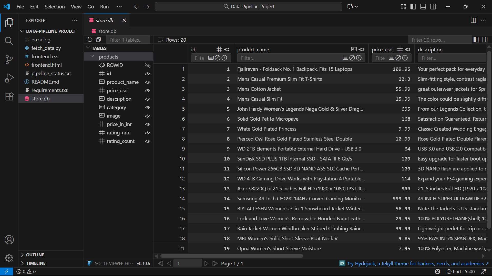

#  Data Pipeline Project

This is a small project I created to understand how a simple **ETL (Extract, Transform, Load)** process works using Python.  

The main goal is to take product data from a public API, make some changes to it, and store it properly inside a database.

---

##  How the Pipeline Works
1. **Extract:** Gets product data from the Fake Store API → https://fakestoreapi.com/products  
2. **Transform:** Changes column names, adds a new column to convert prices from USD to INR, and cleans the data if needed  
3. **Load:** Saves the cleaned data into a local SQLite database file called `store.db`

---

##  Tools & Technologies Used
- **Python 3.14**  
- **Libraries:** `requests`, `pandas`, `sqlite3`  
- **Database:** SQLite  
- **Editor:** Visual Studio Code (for writing and running the code)

---

##  My Project Folder
```
Data-Pipeline_Project/
   -> fetch_data.py
   -> pipeline_status.txt
   -> store.db
   -> frontend.html
   -> requirements.txt
   -> README.md
   -> error.log
```
---
## Dashboard View
After running the code, I checked the data stored in my `store.db` database.  
Here’s a quick look at how it appears inside the table:



---

##  What I Learned
- How to get data from an API using Python  
- How to clean and transform data using Pandas  
- How to save data into a database and check it  
- How to organize files and write a simple README  

---

 *This project helped me understand the complete data flow — from fetching data to saving it neatly inside a database.*


